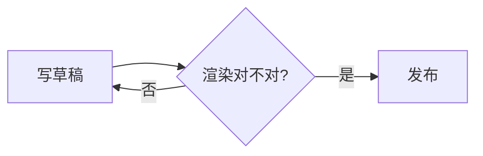

Markdown 语法本身不复杂，麻烦的是**渲染一致性**：GFM、Obsidian、KaTeX、主题的扩展语法各有一亩三分地，常常本地预览没问题，发布出来换了渲染器就乱套——表格折行、diff 不亮、公式糊成一团。

下面这份整理，出发点很实际：把写文章时**真正用得上**的语法按频率收进一张对照表，每个都带写法与效果。它不是语法大全，是速查卡。

## 结构与排版

### 标题分级：正文从二级起

页面顶部的大标题由 frontmatter 的 `title` 渲染,**一级被它占了**,正文里再写 `#` 就会出现两个大标题。所以正文从 `##` 写起，逐级往下，别从 H2 直接跳到 H4——目录与视觉层级会断。

```
## 二级（正文起点）
### 三级
#### 四级
##### 五级
###### 六级
```

<details>
  <summary>点开看 2–6 级标题的实际大小</summary>

<h2>二级</h2>

<h3>三级</h3>

<h4>四级</h4>

<h5>五级</h5>

<h6>六级</h6>

</details>

> 📌 一篇的三级骨架（H2）控制在 3–6 个：读者扫目录就能复述全文讲了什么，是最好的自检。

### 段落、换行与分割线

不空行的连续行会并成一段；想换行不换段，行尾敲两个空格。段落别写太长——手机上五六行就顶天了。

独立成行的 `---`（前后留空行）是分割线。长文里它用来切开逻辑块，下面两条之间就是一条：

写法：

```
上面这段讲段落规则。

---

下面这段讲转义：\* 星号 \_ 下划线 \# 井号
```

效果：

上面这段讲段落规则。

---

下面这段讲转义：\* 星号 \_ 下划线 \# 井号

### 列表：按场景选类型

步骤给有序列表，要点给无序，验收给勾选框。嵌套靠缩进，两层够用，再深就该拆结构了。

```
1. 收集素材
2. 定题
   1. 拆子问题
   2. 排顺序
3. 起草

- [x] 标题已定
- [ ] 描述已写
```

1. 收集素材
2. 定题
   1. 拆子问题
   2. 排顺序
3. 起草

- [x] 标题已定
- [ ] 描述已写

### 表格：列数克制，内容别当仓库

表格只适合“字段 ↔ 含义”这类短对比。第二行冒号控对齐：`:---` 左对齐、`:---:` 居中、`---:` 右对齐；单元格里要写竖线，转义成 `\|`，要换行用 `<br>`。

```
| 左对齐 | 居中 | 右对齐 |
| :--- | :---: | ---: |
| 一 | 二 | 三 |
| 含 `\|` | 也行 | 吧 |
```

```
| 字段 | 必填 | 用途 |
| :--- | :---: | :--- |
| title | ✓ | 页面与卡片标题 |
| description | ✓ | 卡片摘要 |
```

| 字段 | 必填 | 用途 |
| :--- | :---: | :--- |
| title | ✓ | 页面与卡片标题 |
| description | ✓ | 卡片摘要 |

> 💡 移动端血泪：**超过 4 列就是横向滚动灾难**，长文本挤进单元格更是双倍灾难。列多或单元格长，拆小节、上列表。

## 强调与提醒

### 文本样式：一张表收完

修饰类语法没啥可展开的，直接上对照——列顺序是「想实现的效果 / 写法 / 避坑建议」，`mark` 是 HTML，其他都是原生：

| 效果 | Markdown / HTML 写法 | 避坑建议 |
| :--- | :--- | :--- |
| **加粗** | `**核心结论**` | 结论与关键词，一屏别超过两处 |
| *斜体* | `*英文词*` | 英文专有名词；中文尽量别用斜体 |
| ~~删除线~~ | `~~废弃方案~~` | 修订旧说法、已废弃配置 |
| `行内代码` | `` `pnpm run dev` `` | 命令、文件名、变量名统一这么写 |
| <mark>高亮</mark> | `<mark>重点</mark>` | 原生表达不出时借 HTML 标签 |

### 引用与 Callout：引文用 `>`，提醒用 Callout

普通引用放原文或他人观点；想让读者别漏掉的信息，用 Callout——引用块首行写 `[!类型]`，主题渲染成带色提示块。先看普通引用：

```
> 引用块放原文或他人观点；多段时每段前都要写 `>`。
>
> > 嵌套引用，少用。
```

> 引用块放原文或他人观点；多段时每段前都要写 `>`。
>
> > 嵌套引用，少用。

Callout 常用类型：`note` 补充说明、`tip` 省事办法、`warning` 易错点、`danger` 高代价操作：

```markdown
> [!tip] 省事小技巧
> 在 Obsidian 或 Typora 里编辑时直接粘贴剪贴板图片，编辑器会自动生成相对路径。

> [!warning] 嵌套对齐
> Callout 内部若写代码块或列表，每一行的行首都要补 `>`，否则会被挤出容器框。
```

> [!tip] 省事小技巧
> 在 Obsidian 或 Typora 里编辑时直接粘贴剪贴板图片，编辑器会自动生成相对路径。

> [!warning] 嵌套对齐
> Callout 内部若写代码块或列表，每一行的行首都要补 `>`，否则会被挤出容器框。

> 💡 Callout 一篇四五处封顶——遍地提示等于没有提示。

**类型速查**（主题样式表内置 Obsidian 全套类型，带别名）：

| 类型（别名） | 语义 | 建议场景 |
| :--- | :--- | :--- |
| note / info | 中性说明 | 背景补充 |
| tip / hint | 正向建议 | 省事技巧 |
| warning / caution | 提醒 | 易错、注意点 |
| danger / error | 高危 | 出错代价高的操作 |
| success / check | 达成 | 验收、完成结果 |
| question / help | 询问 | 反问句、待确认 |
| bug / failure / example / quote | 杂项 | 按字面语义用 |

第一行写成 `[!tip] 自定义标题` 就能换标题；不写标题则用类型的默认标签。

## 代码与公式

### 代码高亮与 diff：贴代码，不贴截图

截图复制不了、搜不到、深色模式还看不清。多行代码用围栏并在首行声明语言（`ts` / `bash` / `python`），才有语法高亮。

```ts
const greeting = (name: string) => `你好，${name}`;
```

展示改动时，标记加在**行尾**而不是行首——下面这块本身带语言声明与注释，复制即用：

```ts
// 推荐：行尾添加注释标记
const apiEndpoint = "https://v1.api.com"; // [!code --]
const apiEndpoint = "https://v2.api.com"; // [!code ++]
```

> 📌 避坑：别在行首写 `+` / `-`。不同博客主题的高亮插件（Shiki、Prism…）对行首标记的处理规则不一，极易整行高亮失效；行尾的 `[!code --]` / `[!code ++]` 注释才是本站 transformer 的约定，标记本身不会显示。

想教别人“代码块怎么写”也一样：外层围栏比内层多一个反引号（四包三），或外层改用 `~~~`，内层就不会提前闭合。

**行尾标记速查**（主题 transformer 支持，标记本身不显示）：

| 标记 | 含义 |
| :--- | :--- |
| `// [!code ++]` | 新增行（红/绿由主题定） |
| `// [!code --]` | 删除行 |
| `// [!code highlight]` | 整行高亮 |
| `// [!code word:关键词]` | 词级高亮（`!` 结尾表示反选） |

### 公式：文本优先，别贴公式图

`$...$` 行内、`$$...$$` 块级，KaTeX 渲染。公式是文本就能复制、能检索，截图两样都做不到。

$$
\sum_{i=1}^{n} i = \frac{n(n+1)}{2}
$$

行内例子：能量 `$E = mc^2$` 写作 $E = mc^2$。

## 图、链接与边角料

### 图片：相对路径 + 替代文本

语法与链接同构，前置 `!`。替代文本要写清图在讲什么——读屏、图挂了、搜图都靠它。

```

```

### Mermaid：图直接写，不导出

语言名写 mermaid 的围栏即流程图/时序图，页面打开后自动转成图：



**图类型速查**：在 mermaid 围栏内用首行声明类型——`flowchart`/`graph`（流程图）、`sequenceDiagram`（时序）、`classDiagram`（类图）、`stateDiagram-v2`（状态）、`erDiagram`（ER）、`gantt`（甘特）、`pie`、`journey`、`gitGraph`。

### 链接、emoji 与折叠

出处给可点的链接，一堆链接用引用式定义收尾（`[标签][1]`，文末 `[1]: url`）；emoji 用 `:短码:`，别刷屏。常用几个：`:smile:` → 😄、`:rocket:` → 🚀、`:tada:` → 🎉、`:warning:` → ⚠️、`:bulb:` → 💡。折叠给“展开才需要看”的补充，用 `<details>`：

```
<details>
  <summary>公式为什么不推荐截图</summary>

  截图进不了搜索索引，别人复制还得手打。

</details>
```

<details>
  <summary>公式为什么不推荐截图</summary>

  截图进不了搜索索引，别人复制还得手打。

</details>

**脚注（论文式注解）**：正文放上标编号，文末集中注释，编号自动生成、可被多次引用：

```
观点需要补充出处或备注[^1]，正文里的数字可点击跳回文末。

[^1]: 出处与补充说明写在这；同一编号可被多次引用。
```

效果：

观点需要补充出处或备注[^1]，正文里的数字可点击跳回文末。

[^1]: 出处与补充说明写在这；同一编号可被多次引用。

---

速查就到这里。真遇到"本地好看、发布乱套"，先怀疑三类扩展语法：表格、diff 标记、emoji 短码——它们对渲染器最挑食。拿不准就来这张表里对一眼。
